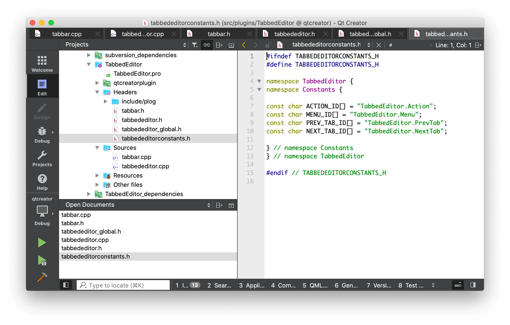

# Qt Creator Tabbed Editor Plugin

[Important]
please note that i rebuild this within QT Creator sourcecode in the plugin subfolder!
original sourcecode is from https://github.com/trollixx/qtcreator-tabbededitor-plugin.git 
extended by  https://github.com/wanjiadenghuo111/qtcreator-tabbededitor-plugin.git

It is now compatible with QT 5.15.2 and QT Creator 4.15.0
If you want to make changes to it you need to setup an instance of QtCreator from Source and add this Plugin Folder into
QT/qt-creator-4.15/src/plugins/ and then start the qtcreator.pro file and just add this plugin under src/plugins.
This was made to easier debug erros occuring while adding the plugin into qtcreator.

I uploaded this not as a fork to github because i started with a fresh created plugin from QT Creator having different filenames than
the original one. 

[mod]
1/add pin/unpin function;
2/auto move to  the right place;
3/auto shrink long name by ...;
4/add plog for debug easy;
5/now, tab just like vscode .

The aim of this project is to provide a tab-based experience in [Qt Creator](http://qt-project.org/wiki/Category:Tools::QtCreator).

## Copyright / License

Copyright (C) 2015 Oleg Shparber

This software is available under the terms of the GNU Lesser General Public License version 3 (LGPLv3).

This project is a fork of [QtCreator Tabbed Editor Plugin](https://sourceforge.net/projects/tabbededitor/) by SNA Soft.
